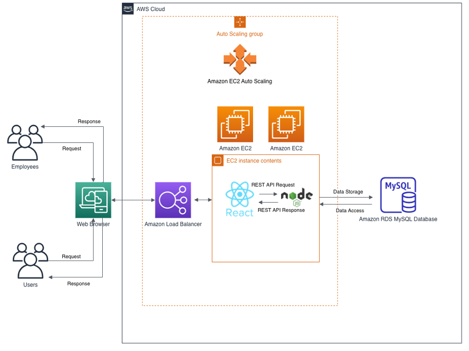
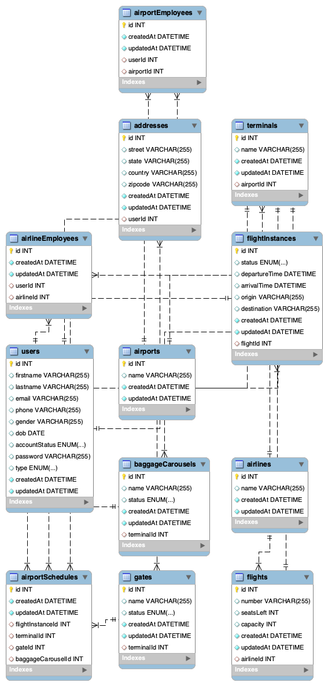

# Airport Application

### Team Name
Team 4

### Team Members
1. Raviteja Gannarapu (SJSU ID: 016650972)
2. Jaya Prakash Reddy Pachika (SJSU ID: 016421873)
3. Dasaradh Gutta (SJSU ID: 015949258)
4. Prudhvi M.V.N.S (SJSU ID: 016597581)

### XP Values
- **Communication:**  Our team communicated with each other regularly and Scrum meetings were held every alternative Monday. We discussed about the dependency, issues faced and provide constructive feedback to each other which helped to progress with the project. We used Github Project Board to track progress of the sprints.
- **Simplicity:** We implemented the essential and required tasks in the project.
- **Feedback:** Each team member provided constructive feedback on the work performed and ensured that the feedback was implemented in the next sprint.
- **Courage:** We had the courage to incorporate any additional details/tasks that were required for the project progress.
- **Respect:** Each team member respected each other’s decisions and timelines.

### Tools and Languages
- Frontend - ReactJS
- Backend - Node.js
- Database – MySQL
- UI Icons – Bootstrap and CSS
- Postman - REST API client to test the developed APIs
- Deployment - Amazon Web Services (AWS)

### Design Decisions

### Architecture Level
- ReactJS as Frontend with React-Redux.
- NodeJS as Backend with Express Framework.
- MySQL as Database with Sequelize Library.
- REST APIs using JSON.
- AWS as the cloud provider.

### Business Level 
- Login for airport and airline employees.
- Arrival and departure flight Schedules based on given hours.
- Add or update flight schedules.
- Auto gates assignment for arriving flights.
- Auto baggage carousel assignments for arrived flights.
- Enable/Disable gates for maintenance.

### Areas of Contribution
- **Frontend:** Raviteja Gannarapu, Jaya Prakash Reddy Pachika, Dasaradh Gutta, Prudhvi M.V.N.S
- **Backend:** Raviteja Gannarapu, Jaya Prakash Reddy Pachika, Dasaradh Gutta, Prudhvi M.V.N.S
- **Architecture & Database Design:** Raviteja Gannarapu, Jaya Prakash Reddy Pachika
- **UI Wireframes:** Dasaradh Gutta, Prudhvi M.V.N.S
- **Deployment:** Raviteja Gannarapu, Jaya Prakash Reddy Pachika, Dasaradh Gutta, Prudhvi M.V.N.S
- **Documentation:** Raviteja Gannarapu, Jaya Prakash Reddy Pachika, Dasaradh Gutta, Prudhvi M.V.N.S

### Architecture Diagram

### Database Design Diagram

### Deployment Diagram

### UI Wireframes
https://github.com/gopinathsjsu/team-project-team-four/blob/main/Documentation/FigmaUIWireframes.pdf

### Scrum Board
https://github.com/orgs/gopinathsjsu/projects/42/views/1

### Project Journal
https://github.com/gopinathsjsu/team-project-team-four/blob/main/Documentation/ProjectJournal/ProjectJournal.md

### Sprint Task Sheet and Burn-down Chart
https://docs.google.com/spreadsheets/d/1Nh1BdyOhCOOXxJthjkFU8YmAl2eKb8Kg

### Steps to Run Application
- Clone the entire repository on work machine and run below cmds.
- Backend npm start
- Frontend npm start

